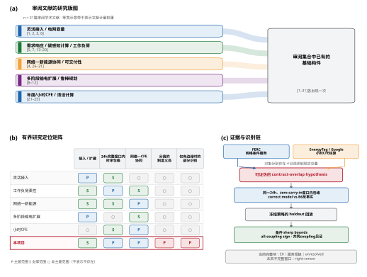
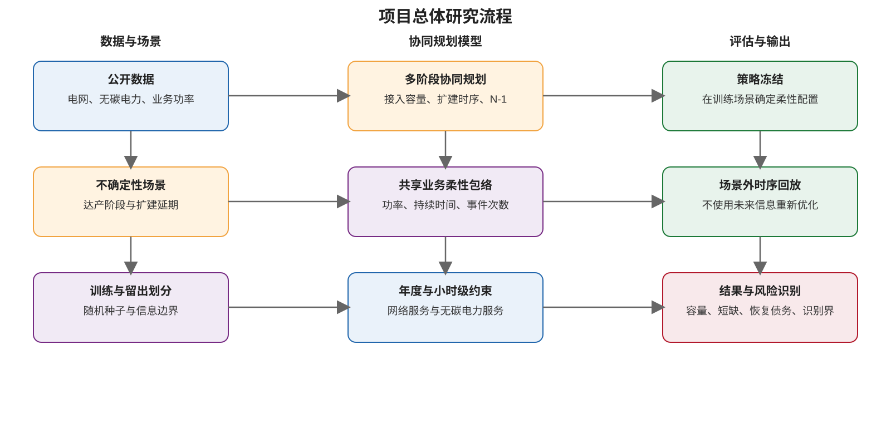
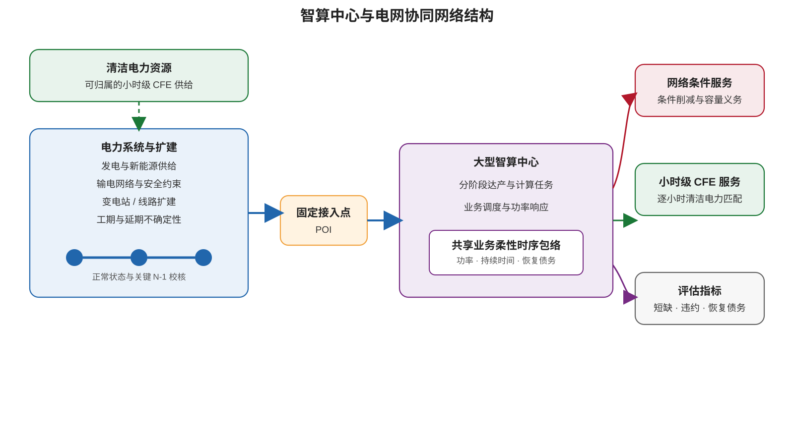

# 达产与扩建延期不确定性下智算中心分阶段接入与小时级绿电协同规划

## 1 摘要

网络条件服务安排与小时级无碳电力（carbon-free energy, CFE）核算/匹配是分别存在的制度对象：前者可通过约定的取电上限、控制与保护措施约束大负荷在网络事件下的用电，后者按同小时和规定地域核算可归属清洁电量。现有公开制度证据尚未建立某一具名数据中心把同一份工作负荷柔性同时承诺给两类义务。本文据此提出一个可证伪的 contract-overlap hypothesis：若两项分离义务映射到同一 temporal workload envelope，分别规划是否会低估共同履约所需的最低业务柔性，并造成固定策略下的服务损失？

本文在相同输入、安全集合和求解标准下，比较共享一个完整 24h、zero-carry-in 窗口内时序包络的 correct model，与允许两项义务分别占用该完整窗口内包络的 B6 double-commitment counterfactual。包络在该 24h 窗口内联合约束瞬时功率、最大持续时间、事件次数、累计能量、恢复功率和恢复债务；它不表示已经实现跨日 carry-in linkage。主容量 estimand 为按 D_DC 归一化的 minimum-flexibility underprovisioning，即 correct 与 B6 的最低所需柔性之差；运行 estimand 为 holdout 中固定策略的服务短缺与恢复状态。当公开网络/CFE块和业务块只有边缘分布而没有共同日历时，本文在保留两侧边缘和块内时序的离散 transport polytope 上计算条件 sharp bounds、all-coupling sign 和多指标共同 coupling witness，并在冻结的 holdout 上回放既定策略。当前主样本均为完整 24h blocks，实际观察状态只区分 E0 外生电网不可行、service shortfall 和 solver unresolved；right-censoring 仅保留为未来不完整窗口扩展的预注册状态，当前样本不声称观察到该状态。

该设计可检验哪些边缘分布与结构约束足以排除、容许或迫使 underprovisioning 与服务损失，并明确何种共同时间戳、合同—计量—工作负荷映射能够收窄识别区间。首篇研究聚焦这一 RQ2 问题链；多阶段 F/X 接入、电网扩建延期以及年度/小时 CFE 对规划决策的影响作为项目后续扩展。

**关键词：**智算中心；网络条件服务；小时级CFE；业务柔性；重复承诺；部分识别；固定策略回放

## 2 研究现状

### 2.1 两类制度对象及 contract-overlap hypothesis

FERC 195 FERC ¶ 61,216 及其引用的 PJM precedent 表明，愿意且能够限制 withdrawal 的大型负荷可以按指定 MW contract level 接受网络侧服务，并由控制或保护措施执行取电边界。EnergyTag Granular Certificate Matching Standard 与 Google 24/7 CFE 方法支持按同一时间间隔、规定地域和计量边界开展小时级 CFE 的 ex-post accounting/matching。两条证据链分别支撑 network-contingent service arrangement 与 hourly-CFE accounting/matching；共同合同、计量和内部工作负荷映射仍需直接证据。因此，本文把两类义务对同一 temporal workload envelope 的潜在交叠登记为可证伪的 contract-overlap hypothesis。

### 2.2 灵活接入与电网容量规划

数据中心接入研究已覆盖候选站址、容量分配和互联扩展。Kim、Dong和Xie[1]把 firm、pause 与 shift 包络纳入规划者主动选址和逐时单故障筛选，说明柔性可改变候选接入点评价；Chen和Zheng[2]在投资—逐时运行模型中比较工作延期、时移和跨节点转移对互联容量扩展的影响。Li、Fang和Chen[3]将 robust firm capacity、CVaR flexible capacity 与位置属性用于静态输电容量分配，Mytton等[6]则从电网容量压力和治理流程说明大型数据中心接入的现实约束。这些工作建立了 flexible interconnection 和 grid-capacity planning 的直接基础。本文首篇聚焦分离制度义务的共同业务资源；固定POI下的多阶段F/X释放、扩建工期与延期保留为项目扩展。

### 2.3 需求响应、碳感知计算与工作负荷包络

Wierman等[13]系统梳理了数据中心需求响应的技术机会与运营约束，Liu等[14]研究了公用事业峰值需求响应中的工作负荷调节和成本。Goiri等的 GreenSlot[15]以及 Parasol and GreenSwitch[16]分别以批作业调度和系统协同利用现场可再生能源；Qureshi等[17]通过跨地域路由利用电价差，Liu等[18]通过 geographical load balancing 跟随可再生能源供给。Radovanović等[19]进一步用区域碳强度形成逐时 virtual capacity curve，建立了实际数据中心的 carbon-aware computing 路径。

资源约束方面，Kwag和Kim[20]说明需求响应需要超越单一静态MW上限；Crozier和Liska[7]综述了保护、预冷、CPU/GPU调节和作业调度等柔性来源；Williams等[5]以GPU集群和推理业务实证分析快速响应与持续削减。上述研究支撑工作负荷可调性及功率、持续时间和恢复参数的技术边界。本文把这些既有机制组织进两项义务共享的完整 24h、zero-carry-in 窗口内时序包络，并以B6反事实检验分离规划的后果。

### 2.4 统一调度下的网络—新能源协同与可交付性

Wan和Li[4]把数据中心时空负荷灵活性纳入 security-constrained unit commitment，在统一调度变量下缓解拥塞并促进新能源利用。Wan、Fang和Li[26]的 arXiv:2511.08759 于2025年发布v1、2026年更新v2，以单一空间重分配变量分析拥塞、弃电与成本；Ma等[27]用内生节点价格驱动时空移峰；Lin和Chien[28]研究多站点 load decoupling 资源的碳收益分配；Zhang等[29]则刻画输电约束如何降低柔性资源的可用性。这些工作正面建立了统一物理调度下的网络—新能源协同基准。

Fan和Zhao[30]联合优化 workload distribution 与 regulation capacity commitment，并以 chance constraints 和 queue-VaR constraints 约束 instantaneous/cumulative deliverability。Khanal等[31]在PJM和韩国容量扩展中建模 firm/flexible/interruptible tiers，以及 depth、duration、ramp、minimum recovery、年度能量和小时上限。因此，capacity commitment、deliverability、event shape 和 recovery 已有明确优先权。本文的可辨识差异是 network-contingent 与 hourly-CFE 两项分离义务、共享完整 24h 窗口内包络与B6反事实的公平比较，以及未知跨源联合律下的具体 estimand 识别。

### 2.5 多阶段输电扩展与鲁棒规划

Han、Kim和Lee[8]用场景树研究需求不确定性下的长期多阶段输电扩展；Webster[9]提出广域多阶段随机输电扩展算法；Akhavizadegan、Wang和McCalley[10]研究迭代随机扩展中的场景选择。Jabr[11]处理新能源与负荷不确定性下的鲁棒输电扩展，Li等[12]进一步把多重不确定性和主动负荷纳入规划。这些研究为场景树、非预见性、鲁棒性和扩建决策提供方法基础。项目后续扩展将这些方法用于固定POI的数据中心达产、F/X释放和工程延期，但不把多阶段规划或鲁棒优化本身作为首篇贡献。

### 2.6 年度匹配、小时级CFE与清洁计算

de Chalendar和Benson[21]指出年度100%可再生能源声明不能完整反映用电时段与系统脱碳；Miller、Novan和Jenn[22]量化了小时核算与年度/月度聚合之间的差异。Riepin和Brown[23]比较年度与24/7 CFE采购的成本和系统影响，Riepin、Jenkins、Swezey和Brown[24]分析24/7匹配对先进清洁技术部署的影响。Riepin、Brown和Zavala[25]进一步联合优化计算负荷的时空转移，以提高计算活动与清洁电力在时间和空间上的一致性。这些工作构成年度/小时核算、采购与清洁计算调度的直接基准。本文在此基础上研究分离的网络条件义务与小时CFE义务是否索取同一业务包络。

### 2.7 公开边缘、部分识别与问题定位

RTS-GMLC网络/CFE块与Alibaba业务块没有共同日历，independent、comonotone 和 countermonotone pairing 只能作为允许 coupling 中的诊断点。本文以完整离散 transport polytope 表示未知联合律：单指标端点保存 primal/dual 和 endpoint witness；all-coupling sign 只在全部允许 coupling 上判定；多指标区域要求同一个 coupling 见证。共同时间戳、合同触发、设施计量、workload queue/dispatch 和资源分池记录可收紧 ambiguity set。由此，31篇学术工作和三类制度资料共同界定 Problem 与方法边界，而阴性、跨 coupling 变号、E0 和 unresolved 状态均进入当前完整块的可审计证据链；right-censoring 只属于未来不完整窗口扩展，不是当前样本的观察结果。

**图1 当前研究现状与本项目定位**。基于本文审阅的31篇学术文献所作的结构化定位，不是穷尽性 bibliometric result；三项制度资料仅支撑两类对象分别存在，不证明现实 contract overlap。

## 3 首篇贡献与项目扩展

### 3.1 首篇贡献A：分离义务的共同资源映射与公平反事实

本文把两项已分别获得制度证据支持的义务映射到同一 temporal workload envelope，并把完整 24h、zero-carry-in 窗口内包络、共享 correct model 与 B6 double-commitment counterfactual 组成一个公平比较。两种模型使用相同输入、安全标准和训练支持；holdout 只执行冻结策略。“共同资源映射—错误反事实—可审计服务后果”的组合构成这一贡献单元，各单项技术沿用已有研究基础。

### 3.2 首篇贡献B：具体 estimand 的条件 sharp 部分识别

本文针对 normalized minimum-flexibility underprovisioning 和 fixed-policy service loss，在公开边缘的 transport polytope 上计算条件 sharp bounds、all-coupling sign 与共同 coupling witness，并用固定策略 holdout replay 连接规划差异和运行后果。当前完整 24h blocks 分别编码 E0、service shortfall 与 solver unresolved；right-censoring 仅为未来不完整窗口扩展保留，从而使识别结论、业务损失、窗口完整性和数值证据保持可区分。贡献体现为面向具体 estimand 的 partial-identification application、冻结策略回放与证据状态链。

### 3.3 项目扩展：多阶段 F/X—扩建—年度/小时 CFE

后续项目在首篇机制与识别链之外，研究数据中心达产、电网工程工期与延期逐步揭示时的非预见性多阶段 F/X 释放和扩建决策，并比较年度与小时 CFE 对接入容量、扩建时序和柔性分配的影响。该扩展形成包含 F/X、建设 lead time、正常态与关键 N-1、年度/小时匹配的长期研究蓝图。

## 4 研究目标与主要内容

### 4.1 首篇目标

在公开数据条件下，检验两项分离制度义务对同一业务包络的潜在交叠是否导致 normalized minimum-flexibility underprovisioning 或 fixed-policy service loss，并识别哪些边缘与结构条件足以排除、容许或迫使这些风险。

### 4.2 主要内容

1. 分别建立 network-contingent arrangement 与 hourly-CFE accounting/matching 的制度证据链，并冻结 contract-overlap hypothesis；
2. 在同一训练支持上求解共享 correct model 与 B6 counterfactual 的最低柔性配置；
3. 对完整 training support 进行审计，按时序在 holdout 上回放冻结的、仅使用当前可见状态的策略；
4. 在 finite-grid support 条件下计算 transport sharp bounds、all-coupling sign 与共同 coupling witness，并单列无条件 E0 质量；
5. 报告 underprovisioning、service shortfall、recovery debt 和 unresolved 状态；若未来纳入不完整窗口，再单列 right-censoring；
6. 评估共同时间戳、合同触发和资源映射数据对识别区间宽度的收缩作用；
7. 在后续项目中扩展到多阶段 F/X、扩建时序及年度/小时 CFE 对照。

图2  项目总体研究流程

图3  智算中心与电网协同网络结构

## 5 项目可行性与当前状态

### 5.1 数据、模型与复现基础

项目已形成 RTS-GMLC 24 小时网络/CFE blocks 和 Alibaba 24 小时 workload blocks 的分源、版本化数据包，训练/holdout 严格分离。当前主样本全部是完整 24h、zero-carry-in blocks；尚无跨日 carry-in linkage，也没有当前样本中的 right-censored block。实现已覆盖 E0 判定、完整 training-support 审计、minimum-flexibility 规划、B6 分离规划/共享执行、固定策略回放、transport bounds、共同 coupling feasibility、四臂增强基线的 validate-only 接口，以及按 block 隔离的 formal bootstrap/controller、checkpoint、resource journal 和 manifest 契约。配置、solver certificate、残差和工件均按版本与 SHA-256 审计。上述实现与 validate-only 能力仅证明代码路径和关闭门禁可检查，不等于正式实验已经执行，也不构成正式结果、论文结论或安全认证。

### 5.2 既有证据与当前执行状态

冻结70-cell/旧formal-batch derived benchmark完整保留为 R1=0、R2=0、R3=69、mixed=1、unresolved=0；original positive H2 unsupported。该结果是阴性或边界证据，不能通过结果后调参改写。

固定顺序 `holdout_s20260822_0008 → holdout_s20260822_0009` 的 V8 nonformal two-block pilot 已分别取得 pre-run independent PASS 和 post-result independent PASS；该证据只关闭此次非正式 pilot 的对应门禁，不授予 formal execution authority。Formal activation V1–V4 均未取得执行许可，V4 现仅作为 historical `ESCALATE` 记录保留。V5 目前仍是 `DRAFT_NONAUTHORITATIVE`，处于 pre-seal findings 的原地整改与复核阶段，尚未 seal，也未获得独立 activation PASS 或 user formal-run authority。

因此，1071-block grid、后续 pairwise replay 和 identification 均未运行或发布；formal result、paper claim 和 security certification gates 全部保持关闭。TimeLimit、resource stop、unresolved、缺失 incumbent 或不完整 certificate 均不构成 mathematical infeasibility。以上仅为项目执行状态，不作为论文结果。

## 6 预期成果与研究边界

### 6.1 预期成果

1. 一个分离制度义务到共同 temporal workload envelope 的可审计映射与 B6 反事实；
2. normalized minimum-flexibility underprovisioning 和 fixed-policy service loss 的条件 sharp identified set；
3. all-coupling sign、共同 coupling witness 及识别区间收缩的数据需求说明；
4. 对当前完整 24h blocks 保留 E0、服务短缺与未决状态的固定策略 holdout 证据链，并把右删失限定为未来不完整窗口扩展状态；
5. 作为后续项目扩展的多阶段 F/X—扩建—年度/小时 CFE 模型。

### 6.2 研究边界

本文主 estimand 是按 D_DC 归一化的 minimum-flexibility underprovisioning，不解释为条件容量 X 高估。公开边缘上的 bounds 是相对于声明 transport polytope 的条件识别区间，不是现实合同重叠发生率、真实违约概率或因果效应。selected-N-1 DC benchmark 用于规划与机制分析，不构成工程安全认证。CFE 表示同小时、规定地域内可归属清洁电量的核算/匹配，不追踪流向数据中心的电子。制度结果只说明两类对象分别存在；在取得共同合同、计量与 workload/resource mapping 前，正式解释限于公开 benchmark 下的条件结论。

## 7 参考文献

[1] Kim, D., Dong, L. and Xie, L. (2026). “Flexibility-aware framework for efficient planner-initiated siting of data center.” Nature Communications. https://doi.org/10.1038/s41467-026-72324-9

[2] Chen, Y. and Zheng, X. (2026). “To Defer or To Shift? The Role of AI Data Center Flexibility on Grid Interconnection.” ACM Sustainability Week. https://doi.org/10.1145/3765611.3815593; https://arxiv.org/abs/2604.05376

[3] Li, S., Fang, B. and Chen, C. (2026). “Risk-Aware Allocation of Transmission Capacity for AI Data Centers.” arXiv preprint arXiv:2604.08854. https://arxiv.org/abs/2604.08854

[4] Wan, H. and Li, X. (2026). “Data Center Spatio-Temporal Load Flexibility in Security-Constrained Unit Commitment for Enhanced Grid Efficiency and Reliability.” arXiv preprint arXiv:2605.18517. https://arxiv.org/abs/2605.18517

[5] Williams, C., Colangelo, P., Coskun, A. et al. (2026). “Power-Flexible AI Data Centers: A New Paradigm for Grid-Responsive Compute.” arXiv preprint arXiv:2606.25098. https://arxiv.org/abs/2606.25098

[6] Mytton, D., Ashtine, M., Wheeler, S. and Wallom, D. (2023). “Stretched grid? Managing data center energy demand and grid capacity.” Oxford Open Energy. https://doi.org/10.1093/ooenergy/oiad014

[7] Crozier, C. and Liska, M. (2025). “The Potential of Data Center Energy Demand To Provide Grid Flexibility.” Current Sustainable/Renewable Energy Reports. https://doi.org/10.1007/s40518-025-00258-9

[8] Han, S., Kim, H.-J. and Lee, D. (2020). “A Long-Term Evaluation on Transmission Line Expansion Planning with Multistage Stochastic Programming.” Energies. https://doi.org/10.3390/en13081899

[9] Webster, M. (2022). “A Multistage Stochastic Transmission Expansion Algorithm for Wide-Area Planning under Uncertainty.” Technical report. https://doi.org/10.2172/1737833

[10] Akhavizadegan, F., Wang, L. and McCalley, J. (2020). “Scenario Selection for Iterative Stochastic Transmission Expansion Planning.” Energies. https://doi.org/10.3390/en13051203

[11] Jabr, R. A. (2013). “Robust Transmission Network Expansion Planning With Uncertain Renewable Generation and Loads.” IEEE Transactions on Power Systems. https://doi.org/10.1109/TPWRS.2013.2267058

[12] Li, W., Zhao, L., Bo, Y. et al. (2021). “Robust transmission expansion planning model considering multiple uncertainties and active load.” Global Energy Interconnection. https://doi.org/10.1016/j.gloei.2021.11.009

[13] Wierman, A., Liu, Z., Liu, I. and Mohsenian-Rad, H. (2014). “Opportunities and Challenges for Data Center Demand Response.” 2014 International Green Computing Conference, pp. 1–10. https://doi.org/10.1109/IGCC.2014.7039172

[14] Liu, Z., Wierman, A., Chen, Y. et al. (2013). “Data center demand response.” ACM SIGMETRICS. https://doi.org/10.1145/2465529.2465740

[15] Goiri, I., Le, K., Haque, M. E. et al. (2011). “GreenSlot.” SC Conference. https://doi.org/10.1145/2063384.2063411

[16] Goiri, I., Katsak, W., Le, K. et al. (2013). “Parasol and GreenSwitch.” ASPLOS. https://doi.org/10.1145/2451116.2451123

[17] Qureshi, A., Weber, R., Balakrishnan, H. et al. (2009). “Cutting the electric bill for internet-scale systems.” ACM SIGCOMM. https://doi.org/10.1145/1592568.1592584

[18] Liu, Z., Lin, M., Wierman, A. et al. (2011). “Geographical load balancing with renewables.” ACM SIGMETRICS Performance Evaluation Review. https://doi.org/10.1145/2160803.2160862

[19] Radovanović, A., Koningstein, R., Schneider, I. et al. (2023). “Carbon-Aware Computing for Datacenters.” IEEE Transactions on Power Systems. https://doi.org/10.1109/TPWRS.2022.3173250; https://arxiv.org/abs/2106.11750

[20] Kwag, H.-G. and Kim, J.-O. (2012). “Optimal combined scheduling of generation and demand response with demand resource constraints.” Applied Energy. https://doi.org/10.1016/j.apenergy.2011.12.075

[21] de Chalendar, J. A. and Benson, S. M. (2019). “Why 100% Renewable Energy Is Not Enough.” Joule. https://doi.org/10.1016/j.joule.2019.05.002

[22] Miller, G. J., Novan, K. and Jenn, A. (2022). “Hourly accounting of carbon emissions from electricity consumption.” Environmental Research Letters. https://doi.org/10.1088/1748-9326/ac6147

[23] Riepin, I. and Brown, T. (2024). “On the means, costs, and system-level impacts of 24/7 carbon-free energy procurement.” Energy Strategy Reviews. https://doi.org/10.1016/j.esr.2024.101488; https://arxiv.org/abs/2403.07876

[24] Riepin, I., Jenkins, J. D., Swezey, D. and Brown, T. (2025). “24/7 carbon-free electricity matching accelerates adoption of advanced clean energy technologies.” Joule. https://doi.org/10.1016/j.joule.2024.101808

[25] Riepin, I., Brown, T. and Zavala, V. M. (2025). “Spatio-temporal load shifting for truly clean computing.” Advances in Applied Energy, 17, 100202. https://doi.org/10.1016/j.adapen.2024.100202; https://arxiv.org/abs/2405.00036

[26] Wan, H., Fang, L. and Li, X. (2025/2026). “Grid Operational Benefit Analysis of Data Center Spatial Flexibility: Congestion Relief, Renewable Energy Curtailment Reduction, and Cost Saving.” arXiv preprint arXiv:2511.08759, v1 2025-11-11, v2 2026-03-27. https://arxiv.org/abs/2511.08759

[27] Ma, D., Ye, Y., Wu, Y. et al. (2025). “Bi-Level Optimisation Model for Harvesting Spatial-Temporal Load Shifting Flexibility of Data Centres Using Endogenously Formed Locational Price Signal.” IET Smart Grid, 8(1), e70020. https://doi.org/10.1049/stg2.70020

[28] Lin, L. and Chien, A. A. (2025). “Distribution and Management of Datacenter Load Decoupling.” arXiv preprint arXiv:2511.08936. https://arxiv.org/abs/2511.08936

[29] Zhang, W., Fang, L., Zhao, F. et al. (2025). “Operational risk assessment of power system considering transmission limitation on flexible resources and its application to SCUC.” AIP Advances, 15, 115016. https://doi.org/10.1063/5.0302342

[30] Fan, Y. and Zhao, J. (2026). “Harnessing Flexible Spatial and Temporal Data Center Workloads for Grid Regulation Services.” arXiv preprint arXiv:2602.01508. https://arxiv.org/html/2602.01508

[31] Khanal, S., Roh, G., Yao, B. et al. (2026). “Shift or curtail? How much data-center flexibility is worth depends on the host power grid.” arXiv preprint arXiv:2608.19622. https://arxiv.org/html/2608.19622

## 8 制度与标准资料

- Federal Energy Regulatory Commission (2026). 195 FERC ¶ 61,216; Docket EL26-69-000, Order Instituting Proceeding Under Section 206 of the Federal Power Act. https://www.ferc.gov/sites/default/files/2026-06/EL26-69-000.pdf
- EnergyTag (2024). Granular Certificate Matching Standard, Version 1. https://energytag.org/wp-content/uploads/2024/03/Granular-Certificate-Matching-Standard_V1.pdf
- Google (2021). 24/7 Carbon-Free Energy: Methodologies and Metrics. https://sustainability.google/reports/24x7-carbon-free-energy-methodologies-metrics/
