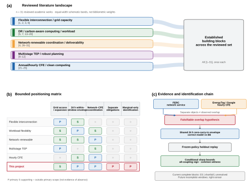
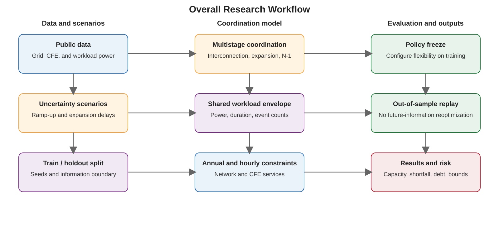
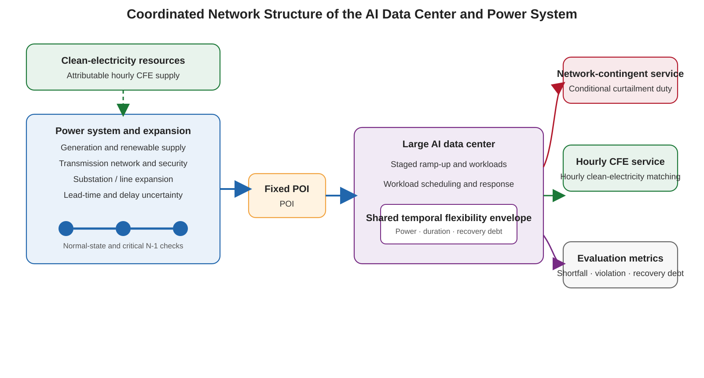

# Phased Interconnection and Hourly Green-Electricity Coordination Planning for AI Data Centers under Uncertainty in Capacity Ramp-Up and Grid-Expansion Delays

## 1 Abstract

Network-contingent service arrangements and hourly carbon-free-energy (CFE) accounting and matching are separately documented institutional objects. The former can limit large-load withdrawals through a contracted MW level and associated control or protection measures; the latter attributes clean electricity to consumption within the same hour and specified region. Public institutional evidence does not yet establish that a named data center commits the same workload-flexibility resource to both obligations. This paper therefore poses a falsifiable contract-overlap hypothesis: if the two separate obligations map to the same temporal workload envelope, does separate planning understate the minimum flexibility required for joint delivery and cause service loss under a fixed policy?

Under identical inputs, security sets, and solution standards, the paper compares a correct model with one complete shared within-window envelope over a 24-hour zero-carry-in block against a B6 double-commitment counterfactual in which each obligation is planned against that full within-window envelope. The envelope jointly constrains instantaneous power, maximum duration, event counts, cumulative energy, recovery power, and recovery debt within the block; it does not imply implemented cross-day carry-in linkage. The primary capacity estimand is minimum-flexibility underprovisioning normalized by D_DC, defined as the difference between the minimum flexibility required by the correct and B6 models. The operational estimands are fixed-policy service shortfall and recovery states on holdout data. When public grid/CFE blocks and workload blocks provide only marginal distributions, the analysis preserves both marginals and within-block chronology, computes conditional sharp bounds, the all-coupling sign, and a common-coupling witness over a discrete transport polytope, and replays the frozen policy on holdout blocks. The current main sample consists entirely of complete 24-hour blocks, so its observed states distinguish exogenous grid infeasibility (E0), service shortfall, and solver-unresolved outcomes. Right-censoring is reserved for a future incomplete-window extension and is not claimed as observed in the current sample.

This design tests which marginal and structural conditions exclude, permit, or force underprovisioning and service loss, and identifies the joint timestamps and contract–meter–workload mappings that would narrow the identified set. The primary paper focuses on this RQ2 chain. Multistage F/X interconnection, grid-expansion delays, and the planning effects of annual versus hourly CFE remain project extensions.

**Keywords:** AI data center; network-contingent service; hourly CFE; workload flexibility; double commitment; partial identification; fixed-policy replay

## 2 Related Work

### 2.1 Separate Institutional Objects and the Contract-Overlap Hypothesis

FERC 195 FERC ¶ 61,216 and the PJM precedent it cites show that large loads willing and able to limit withdrawal may receive network-side service up to a specified MW contract level enforced through control or protection measures. The EnergyTag Granular Certificate Matching Standard and Google's 24/7 CFE methodology support ex-post hourly CFE accounting and matching within specified temporal, geographic, and metering boundaries. These evidence chains separately support network-contingent service arrangements and hourly-CFE accounting and matching. Direct evidence linking both obligations to the same contract, meter, and internal workload resource remains necessary. The paper therefore states their potential mapping to one temporal workload envelope as a falsifiable contract-overlap hypothesis.

### 2.2 Flexible Interconnection and Grid-Capacity Planning

Data-center interconnection research covers candidate siting, capacity allocation, and interconnection expansion. Kim, Dong, and Xie [1] incorporate firm, pause, and shift envelopes into planner-initiated siting with hourly and single-contingency screening, showing that flexibility changes candidate-point evaluation. Chen and Zheng [2] compare workload deferral, temporal shifting, and cross-node migration in an investment-and-hourly-operation model of interconnection expansion. Li, Fang, and Chen [3] combine robust firm capacity, CVaR flexible capacity, and locational attributes in static transmission-capacity allocation, while Mytton et al. [6] explain the practical grid-capacity and governance constraints surrounding large data-center connections. These studies establish the flexible-interconnection and grid-capacity-planning baseline. The primary paper focuses on the common workload resource behind separate obligations; multistage F/X release, project lead times, and delays at a fixed point of interconnection remain project extensions.

### 2.3 Demand Response, Carbon-Aware Computing, and Workload Envelopes

Wierman et al. [13] review the technical opportunities and operating constraints of data-center demand response, and Liu et al. [14] study workload control and cost under utility peak-demand response. GreenSlot [15] and Parasol and GreenSwitch [16] use batch scheduling and systems coordination to exploit on-site renewable energy. Qureshi et al. [17] route workloads across locations to use electricity-price differences, while Liu et al. [18] use geographical load balancing to follow renewable supply. Radovanović et al. [19] form hourly virtual capacity curves from regional carbon-intensity signals, establishing an operational carbon-aware-computing pathway.

For resource limits, Kwag and Kim [20] show why demand response requires more than a static MW ceiling. Crozier and Liska [7] review flexibility from protection, precooling, CPU/GPU control, and job scheduling, and Williams et al. [5] provide GPU-cluster and inference-workload evidence on fast response and sustained curtailment. These studies support the technical boundaries of workload adjustability, power, duration, and recovery. The present paper organizes these established mechanisms into a complete shared within-window envelope over a 24-hour zero-carry-in block and uses the B6 counterfactual to test the consequences of separate planning.

### 2.4 Network-Renewable Coordination and Deliverability

Wan and Li [4] incorporate data-center spatiotemporal load flexibility into security-constrained unit commitment, using a unified dispatch variable to relieve congestion and improve renewable utilization. Wan, Fang, and Li [26], posted as arXiv:2511.08759 v1 in 2025 and updated as v2 in 2026, analyze congestion, renewable curtailment, and cost through one spatial-redispatch variable. Ma et al. [27] induce spatiotemporal shifting through endogenous locational prices; Lin and Chien [28] allocate multisite load-decoupling resources for carbon benefits; and Zhang et al. [29] characterize how transmission constraints reduce the availability of flexible resources. Together, these works establish the direct benchmark of network-renewable coordination under unified physical dispatch.

Fan and Zhao [30] jointly optimize workload distribution and regulation-capacity commitment, using chance constraints and queue-VaR constraints for instantaneous and cumulative deliverability. Khanal et al. [31] model firm, flexible, and interruptible tiers in capacity expansion for PJM and Korea, including depth, duration, ramping, minimum recovery, annual energy, and hourly limits. Capacity commitment, deliverability, event shape, and recovery therefore have clear priority boundaries. The paper's identifiable difference is the combination of separate network-contingent and hourly-CFE obligations, a fair shared 24-hour within-window envelope versus B6 comparison, and estimand-specific identification under an unknown cross-source joint law.

### 2.5 Multistage Transmission Expansion and Robust Planning

Han, Kim, and Lee [8] use a scenario tree for long-term multistage transmission expansion under demand uncertainty. Webster [9] develops a wide-area multistage stochastic transmission-expansion algorithm, and Akhavizadegan, Wang, and McCalley [10] study scenario selection for iterative stochastic expansion. Jabr [11] treats robust transmission expansion with uncertain renewable generation and load, while Li et al. [12] add multiple uncertainties and active load. These studies provide the foundations for scenario trees, nonanticipativity, robustness, and expansion decisions. The project extension applies these foundations to fixed-point data-center ramp-up, F/X release, and project delays; multistage or robust optimization is not positioned as a contribution of the primary paper.

### 2.6 Annual Matching, Hourly CFE, and Clean Computing

de Chalendar and Benson [21] show why annual 100% renewable-energy claims do not fully represent consumption timing or power-system decarbonization. Miller, Novan, and Jenn [22] quantify differences between hourly accounting and annual or monthly aggregation. Riepin and Brown [23] compare the cost and system effects of annual and 24/7 CFE procurement, and Riepin, Jenkins, Swezey, and Brown [24] examine how 24/7 matching affects the deployment of advanced clean technologies. Riepin, Brown, and Zavala [25] then jointly optimize spatiotemporal computing-load shifts to align computing activity with clean electricity across time and location. These studies form the direct accounting, procurement, and clean-computing baseline. The present paper asks whether a separate network-contingent obligation and hourly-CFE obligation draw on the same workload envelope.

### 2.7 Public Marginals, Partial Identification, and Positioning

RTS-GMLC grid/CFE blocks and Alibaba workload blocks do not share a calendar. Independent, comonotone, and countermonotone pairings are therefore diagnostic points within the admissible coupling set. The paper represents the unknown joint law with a complete discrete transport polytope. Scalar endpoints retain primal/dual evidence and endpoint witnesses; an all-coupling sign is assigned only when it holds over every admissible coupling; and a multimetric region requires one common coupling witness. Joint timestamps, contract triggers, facility meters, workload queues and dispatch, and resource-pool records can tighten the ambiguity set. The 31 academic works and three institutional sources jointly define the problem and method boundaries. Negative findings, sign changes across couplings, E0, and unresolved outcomes remain auditable states for the current complete blocks; right-censoring belongs only to a future incomplete-window extension and is not a current observation.

**Figure 1. Literature landscape and project positioning**. A structured positioning based on the 31 academic works reviewed in this paper, not an exhaustive bibliometric result; the three institutional sources establish only that the two objects exist separately and do not demonstrate real contract overlap.

## 3 Paper Contributions and Project Extensions

### 3.1 Contribution A: Common-Resource Mapping and a Fair Counterfactual

The paper maps two separately supported institutional obligations to one temporal workload envelope and combines the complete 24-hour zero-carry-in within-window envelope, the shared correct model, and the B6 double-commitment counterfactual in a fair comparison. Both models use the same inputs, security standards, and training support, and holdout evaluation executes only frozen policies. The contribution unit is the combination of common-resource mapping, an explicit error counterfactual, and auditable service consequences; its individual building blocks follow established research foundations.

### 3.2 Contribution B: Conditional Sharp Partial Identification of Specific Estimands

For normalized minimum-flexibility underprovisioning and fixed-policy service loss, the paper computes conditional sharp bounds, the all-coupling sign, and a common-coupling witness over the public-marginal transport polytope. Fixed-policy holdout replay connects planning differences to operational consequences. E0, service shortfall, and solver-unresolved outcomes are encoded separately for the current complete 24-hour blocks, while right-censoring is reserved for a future incomplete-window extension. The contribution is this estimand-specific partial-identification application, frozen-policy replay, and evidence-state chain.

### 3.3 Project Extension: Multistage F/X, Expansion, and Annual/Hourly CFE

The broader project studies nonanticipative multistage F/X release and grid-expansion decisions as data-center ramp-up and project delays are revealed, and compares the effects of annual and hourly CFE on interconnection capacity, expansion timing, and flexibility allocation. F/X semantics, project lead times, normal and selected N-1 states, and annual/hourly matching remain part of this extension beyond the primary paper.

## 4 Research Objectives and Main Contents

### 4.1 Primary Objective

Under public-data constraints, test whether the potential overlap of two separate institutional obligations on one workload envelope produces normalized minimum-flexibility underprovisioning or fixed-policy service loss, and identify the marginal and structural conditions that exclude, permit, or force these risks.

### 4.2 Main Contents

1. Establish separate evidence chains for network-contingent arrangements and hourly-CFE accounting and matching, and freeze the contract-overlap hypothesis;
2. Solve the shared correct model and B6 counterfactual for minimum flexibility on the same training support;
3. Audit complete training support and replay frozen, current-state-only policies on holdout blocks;
4. Compute sharp bounds, the all-coupling sign, and a common-coupling witness conditional on finite-grid support, while reporting unconditional E0 mass separately;
5. Report underprovisioning, service shortfall, recovery debt, and unresolved states; if a future extension admits incomplete windows, report right-censoring separately;
6. Evaluate how joint timestamps, contract triggers, and common-resource mapping data narrow the identified set;
7. Extend the broader project to multistage F/X, expansion timing, and annual/hourly CFE comparisons.

Figure 2. Overall research workflow.

Figure 3. Coordinated network structure of the AI data center and power system.

## 5 Project Feasibility and Current Status

### 5.1 Data, Model, and Reproducibility Foundations

The project has versioned 24-hour RTS-GMLC grid/CFE blocks and 24-hour Alibaba workload blocks with strict training/holdout separation. The current main sample consists entirely of complete 24-hour zero-carry-in blocks; it has neither implemented cross-day carry-in linkage nor a currently observed right-censored block. Implementations cover E0 classification, complete-training-support audits, minimum-flexibility planning, separate B6 planning with shared physical execution, fixed-policy replay, transport bounds, common-coupling feasibility, and bootstrap interfaces. Versioned configurations, solver certificates, residuals, checkpoints, and manifests are audited with SHA-256 hashes.

### 5.2 Existing Evidence and Current Execution Status

The frozen 70-cell/legacy-formal-batch derived benchmark is preserved as R1=0, R2=0, R3=69, mixed=1, and unresolved=0; the original positive H2 is unsupported. These negative and boundary findings remain part of the evidence record and are not revised through post-result tuning.

The fresh v4/v6 cross-solver confirmatory pilot completed and passed semantic validation and independent review. The subsequent v4 Gurobi grid formal attempt was interrupted by a user-initiated full-system restart after nine valid checkpoints, holdout_s20260822_0000 through 0008, had been published. No successor formal output has been published, and the pairwise, identification, paper-claim, and security gates remain closed. The Gurobi 0009 default 900-second and bound-focus 1800-second diagnostics both ended at their TimeLimit and remain unresolved. A HiGHS fresh-child diagnostic accepted the normal baseline for 0008 and 0009, but did not execute the full `_process_block` path and therefore cannot support extrapolation to the same-process formal route. Recovery v1 is consequently recorded as REWORK. The per-block fresh-process v2 implementation is an execution-closed candidate pending independent R4 implementation review, a two-block full-`_process_block` pilot, named-outage comparison, and post-result PASS. Time limits, resource stops, missing incumbents, and incomplete certificates do not establish infeasibility. These statements report project execution status and are not paper results.

## 6 Expected Outputs and Research Boundaries

### 6.1 Expected Outputs

1. An auditable mapping from separate institutional obligations to one temporal workload envelope and a B6 counterfactual;
2. Conditional sharp identified sets for normalized minimum-flexibility underprovisioning and fixed-policy service loss;
3. All-coupling signs, common-coupling witnesses, and a data-requirements account for narrowing identified sets;
4. A fixed-policy holdout evidence chain that preserves E0, service shortfall, and unresolved outcomes for the current complete 24-hour blocks, with right-censoring limited to a future incomplete-window extension;
5. A multistage F/X–expansion–annual/hourly-CFE model as a broader project extension.

### 6.2 Research Boundaries

The primary estimand is minimum-flexibility underprovisioning normalized by D_DC and is not interpreted as overestimation of interconnection capacity X. Bounds from public marginals are conditional identified sets relative to the stated transport polytope; they are not the incidence of real contract overlap, a real contract-failure probability, or a causal effect. The selected-N-1 DC benchmark supports planning and mechanism analysis and does not constitute engineering security certification. CFE denotes clean electricity attributable within the same hour and specified region; it does not trace electrons delivered to the data center. Institutional evidence supports the separate existence of the two objects. Until common contract, meter, and workload/resource mappings are available, formal interpretation remains limited to the public benchmark.

## 7 References

[1] Kim, D., Dong, L. and Xie, L. (2026). “Flexibility-aware framework for efficient planner-initiated siting of data center.” Nature Communications. https://doi.org/10.1038/s41467-026-72324-9

[2] Chen, Y. and Zheng, X. (2026). “To Defer or To Shift? The Role of AI Data Center Flexibility on Grid Interconnection.” ACM Sustainability Week. https://doi.org/10.1145/3765611.3815593; https://arxiv.org/abs/2604.05376

[3] Li, S., Fang, B. and Chen, C. (2026). “Risk-Aware Allocation of Transmission Capacity for AI Data Centers.” arXiv preprint arXiv:2604.08854. https://arxiv.org/abs/2604.08854

[4] Wan, H. and Li, X. (2026). “Data Center Spatio-Temporal Load Flexibility in Security-Constrained Unit Commitment for Enhanced Grid Efficiency and Reliability.” arXiv preprint arXiv:2605.18517. https://arxiv.org/abs/2605.18517

[5] Williams, C., Colangelo, P., Coskun, A. et al. (2026). “Power-Flexible AI Data Centers: A New Paradigm for Grid-Responsive Compute.” arXiv preprint arXiv:2606.25098. https://arxiv.org/abs/2606.25098

[6] Mytton, D., Ashtine, M., Wheeler, S. and Wallom, D. (2023). “Stretched grid? Managing data center energy demand and grid capacity.” Oxford Open Energy. https://doi.org/10.1093/ooenergy/oiad014

[7] Crozier, C. and Liska, M. (2025). “The Potential of Data Center Energy Demand To Provide Grid Flexibility.” Current Sustainable/Renewable Energy Reports. https://doi.org/10.1007/s40518-025-00258-9

[8] Han, S., Kim, H.-J. and Lee, D. (2020). “A Long-Term Evaluation on Transmission Line Expansion Planning with Multistage Stochastic Programming.” Energies. https://doi.org/10.3390/en13081899

[9] Webster, M. (2022). “A Multistage Stochastic Transmission Expansion Algorithm for Wide-Area Planning under Uncertainty.” Technical report. https://doi.org/10.2172/1737833

[10] Akhavizadegan, F., Wang, L. and McCalley, J. (2020). “Scenario Selection for Iterative Stochastic Transmission Expansion Planning.” Energies. https://doi.org/10.3390/en13051203

[11] Jabr, R. A. (2013). “Robust Transmission Network Expansion Planning With Uncertain Renewable Generation and Loads.” IEEE Transactions on Power Systems. https://doi.org/10.1109/TPWRS.2013.2267058

[12] Li, W., Zhao, L., Bo, Y. et al. (2021). “Robust transmission expansion planning model considering multiple uncertainties and active load.” Global Energy Interconnection. https://doi.org/10.1016/j.gloei.2021.11.009

[13] Wierman, A., Liu, Z., Liu, I. and Mohsenian-Rad, H. (2014). “Opportunities and Challenges for Data Center Demand Response.” 2014 International Green Computing Conference, pp. 1–10. https://doi.org/10.1109/IGCC.2014.7039172

[14] Liu, Z., Wierman, A., Chen, Y. et al. (2013). “Data center demand response.” ACM SIGMETRICS. https://doi.org/10.1145/2465529.2465740

[15] Goiri, I., Le, K., Haque, M. E. et al. (2011). “GreenSlot.” SC Conference. https://doi.org/10.1145/2063384.2063411

[16] Goiri, I., Katsak, W., Le, K. et al. (2013). “Parasol and GreenSwitch.” ASPLOS. https://doi.org/10.1145/2451116.2451123

[17] Qureshi, A., Weber, R., Balakrishnan, H. et al. (2009). “Cutting the electric bill for internet-scale systems.” ACM SIGCOMM. https://doi.org/10.1145/1592568.1592584

[18] Liu, Z., Lin, M., Wierman, A. et al. (2011). “Geographical load balancing with renewables.” ACM SIGMETRICS Performance Evaluation Review. https://doi.org/10.1145/2160803.2160862

[19] Radovanović, A., Koningstein, R., Schneider, I. et al. (2023). “Carbon-Aware Computing for Datacenters.” IEEE Transactions on Power Systems. https://doi.org/10.1109/TPWRS.2022.3173250; https://arxiv.org/abs/2106.11750

[20] Kwag, H.-G. and Kim, J.-O. (2012). “Optimal combined scheduling of generation and demand response with demand resource constraints.” Applied Energy. https://doi.org/10.1016/j.apenergy.2011.12.075

[21] de Chalendar, J. A. and Benson, S. M. (2019). “Why 100% Renewable Energy Is Not Enough.” Joule. https://doi.org/10.1016/j.joule.2019.05.002

[22] Miller, G. J., Novan, K. and Jenn, A. (2022). “Hourly accounting of carbon emissions from electricity consumption.” Environmental Research Letters. https://doi.org/10.1088/1748-9326/ac6147

[23] Riepin, I. and Brown, T. (2024). “On the means, costs, and system-level impacts of 24/7 carbon-free energy procurement.” Energy Strategy Reviews. https://doi.org/10.1016/j.esr.2024.101488; https://arxiv.org/abs/2403.07876

[24] Riepin, I., Jenkins, J. D., Swezey, D. and Brown, T. (2025). “24/7 carbon-free electricity matching accelerates adoption of advanced clean energy technologies.” Joule. https://doi.org/10.1016/j.joule.2024.101808

[25] Riepin, I., Brown, T. and Zavala, V. M. (2025). “Spatio-temporal load shifting for truly clean computing.” Advances in Applied Energy, 17, 100202. https://doi.org/10.1016/j.adapen.2024.100202; https://arxiv.org/abs/2405.00036

[26] Wan, H., Fang, L. and Li, X. (2025/2026). “Grid Operational Benefit Analysis of Data Center Spatial Flexibility: Congestion Relief, Renewable Energy Curtailment Reduction, and Cost Saving.” arXiv preprint arXiv:2511.08759, v1 2025-11-11, v2 2026-03-27. https://arxiv.org/abs/2511.08759

[27] Ma, D., Ye, Y., Wu, Y. et al. (2025). “Bi-Level Optimisation Model for Harvesting Spatial-Temporal Load Shifting Flexibility of Data Centres Using Endogenously Formed Locational Price Signal.” IET Smart Grid, 8(1), e70020. https://doi.org/10.1049/stg2.70020

[28] Lin, L. and Chien, A. A. (2025). “Distribution and Management of Datacenter Load Decoupling.” arXiv preprint arXiv:2511.08936. https://arxiv.org/abs/2511.08936

[29] Zhang, W., Fang, L., Zhao, F. et al. (2025). “Operational risk assessment of power system considering transmission limitation on flexible resources and its application to SCUC.” AIP Advances, 15, 115016. https://doi.org/10.1063/5.0302342

[30] Fan, Y. and Zhao, J. (2026). “Harnessing Flexible Spatial and Temporal Data Center Workloads for Grid Regulation Services.” arXiv preprint arXiv:2602.01508. https://arxiv.org/html/2602.01508

[31] Khanal, S., Roh, G., Yao, B. et al. (2026). “Shift or curtail? How much data-center flexibility is worth depends on the host power grid.” arXiv preprint arXiv:2608.19622. https://arxiv.org/html/2608.19622

## 8 Institutional and Standards Sources

- Federal Energy Regulatory Commission (2026). 195 FERC ¶ 61,216; Docket EL26-69-000, Order Instituting Proceeding Under Section 206 of the Federal Power Act. https://www.ferc.gov/sites/default/files/2026-06/EL26-69-000.pdf
- EnergyTag (2024). Granular Certificate Matching Standard, Version 1. https://energytag.org/wp-content/uploads/2024/03/Granular-Certificate-Matching-Standard_V1.pdf
- Google (2021). 24/7 Carbon-Free Energy: Methodologies and Metrics. https://sustainability.google/reports/24x7-carbon-free-energy-methodologies-metrics/
